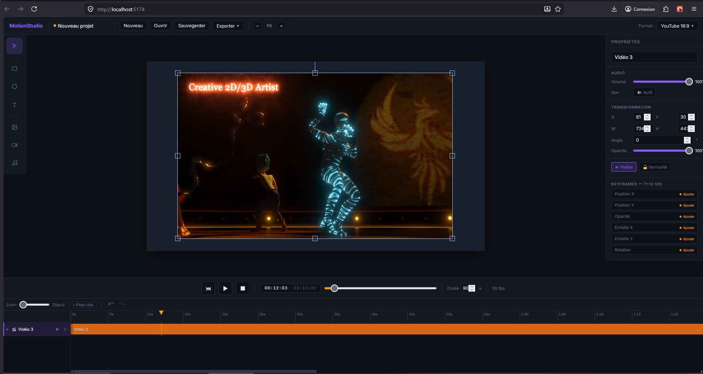

<div align="center">



# 🎬 MotionStudio

### Éditeur d'animation web professionnel open source
**Animer · Composer · Synchroniser · Exporter**

[](https://spiritzen.github.io/MotionStudio/)
[](https://github.com/Spiritzen)
[](https://spiritzen.github.io/portfolio/)
[](https://www.linkedin.com/in/sebastien-cantrelle-26b695106/)

---

> **MotionStudio** est un éditeur d'animation web professionnel open source,
> inspiré de Premiere Pro et After Effects, 100% front-end, zéro serveur.
> Animez des objets sur canvas, synchronisez audio et vidéo sur une timeline
> professionnelle, et exportez vos projets directement depuis le navigateur.

</div>

## 🌍 Demo live

### 👉 [https://spiritzen.github.io/MotionStudio/](https://spiritzen.github.io/MotionStudio/)

---

## ✨ Pourquoi MotionStudio ?

| Besoin | MotionStudio |
|--------|--------------|
| Animer des objets sans installation | ✅ 100% navigateur, zéro plugin |
| Timeline professionnelle avec keyframes | ✅ Clips déplaçables, keyframes drag |
| Importer et animer des vidéos | ✅ MP4 / WebM avec son synchronisé |
| Ajouter une bande sonore | ✅ Import MP3 / WAV via Web Audio API |
| Découper des clips comme dans Premiere | ✅ Outil ciseaux ✂️ sur toutes les pistes |
| Gérer plusieurs pistes vidéo | ✅ Multi-pistes avec visibilité par plage |
| Sauvegarder et reprendre son travail | ✅ Auto-save localStorage + export .motionstudio |
| Travailler sur différents formats | ✅ YouTube, TikTok, Instagram, LinkedIn… |
| Annuler une erreur | ✅ Undo/Redo Ctrl+Z / Ctrl+Y (50 états) |

---

## 🚀 Fonctionnalités

### 🎨 Canvas & Objets
- **Rectangle, Cercle** — création en un clic, couleur personnalisable
- **Texte** — édition inline, couleur, taille, gras, italique
- **Import Image** — JPG, PNG, WebP, GIF, SVG
- **Import Vidéo** — MP4, WebM avec rendu canvas en temps réel
- **Sélecteur professionnel** — drag, resize, rotation avec poignées Fabric.js
- **Inspector** — modification X, Y, W, H, angle, opacité, couleur en temps réel
- **Zoom canvas** — de 10% à 200%, Ctrl+molette, scroll H/V si dépassement
- **Formats prédéfinis** — YouTube 16:9 · YouTube Short · TikTok · Instagram · Twitter/X · LinkedIn · Personnalisé

### 🎬 Timeline Professionnelle
- **Clips visuels** — barre colorée par type (purple=rect, amber=circle, blue=text, teal=image, red=vidéo, cyan=audio)
- **Drag & Drop** — déplacer un clip horizontalement pour changer son startTime
- **Resize clips** — étirer les bords gauche/droit pour modifier la durée
- **✂️ Outil Ciseaux** — découpe un clip au point voulu, crée automatiquement une nouvelle piste
- **Multi-pistes vidéo** — plusieurs vidéos sur des pistes séparées, visibilité gérée par plage
- **Scroll horizontal** — accès à toute la durée même sur de longs projets
- **Labels fixes** — noms des pistes restent visibles pendant le scroll
- **Zoom timeline** — slider de 20 à 200px/seconde
- **Réordonnancement** — drag & drop vertical des pistes

### ⏱️ Keyframes & Animation
- **Keyframes visuels** — losanges ◆ draggables sur chaque piste
- **Propriétés animables** — Position X/Y · Opacité · Échelle X/Y · Rotation
- **Interpolation GSAP** — moteur d'animation ultra-performant
- **Ajout depuis l'Inspector** — bouton "◆ Ajouter" par propriété à currentTime

### ▶️ Lecture & Transport
- **Play / Pause / Stop** — contrôles complets
- **Scrubber drag** — navigation précise dans le temps
- **Timecode** — affichage MM:SS:FF
- **Auto-scroll** — la timeline suit la tête de lecture

### 🔊 Audio
- **Son vidéo MP4** — synchronisé avec la timeline, mute/unmute par piste
- **Import MP3 / WAV / OGG** — pistes audio autonomes via **Web Audio API**
- **Zéro grésillements** — buffer décodé entièrement en mémoire
- **Volume par piste** — slider 0–100% dans l'Inspector
- **Mute par piste** — bouton 🔊/🔇 dans la timeline

### 💾 Sauvegarde & Export
- **Auto-save** — localStorage toutes les 30 secondes
- **Export .motionstudio** — fichier JSON complet
- **Import .motionstudio** — restauration fidèle du projet
- **Export code GSAP** — animation réutilisable en développement

### ↩️ Historique
- **Undo** — Ctrl+Z (50 états)
- **Redo** — Ctrl+Y ou Ctrl+Shift+Z
- **Boutons visuels** — ↺ ↻ au-dessus de la timeline

---

## ⌨️ Raccourcis clavier

| Touche | Action |
|--------|--------|
| `Espace` | Play / Pause |
| `Ctrl+Z` | Annuler |
| `Ctrl+Y` | Rétablir |
| `S` | Activer l'outil ciseaux |
| `Ctrl+S` | Sauvegarder |
| `Ctrl+=` | Zoomer le canvas |
| `Ctrl+-` | Dézoomer le canvas |
| `Ctrl+0` | Canvas à 100% |
| `Suppr` | Supprimer l'objet sélectionné |
| `Échap` | Désélectionner / Retour sélecteur |

---

## 🛠 Stack technique

| Technologie | Rôle |
|-------------|------|
| React 18 | Interface composants |
| TypeScript | Typage strict |
| Vite | Build ultra-rapide |
| Fabric.js v6 | Canvas, objets, interactions |
| GSAP | Moteur d'animation, timeline, easing |
| Zustand | State management |
| Web Audio API | Pistes audio MP3/WAV sans grésillements |
| CSS Modules | Styles scopés |
| GitHub Pages | Hébergement + CI/CD GitHub Actions |

---

## 🏗 Architecture

```
src/
├── components/
│   ├── Canvas/CanvasEditor.tsx       # Fabric.js, master render loop vidéo
│   ├── Timeline/Timeline.tsx         # Timeline scrollable, clips, ciseaux
│   ├── Timeline/TimelineTrack.tsx    # Clip drag/resize par piste
│   ├── Toolbar/Toolbar.tsx           # Outils + import image/vidéo/audio
│   ├── Inspector/Inspector.tsx       # Propriétés + couleurs + keyframes
│   ├── PlaybackControls/             # Play/Pause/Stop/Scrub/Timecode
│   └── ProjectManager/              # Topbar : save, export, zoom, format
├── engine/
│   ├── animationEngine.ts            # RAF loop, GSAP, sync multi-vidéo/audio
│   ├── audioManager.ts               # Web Audio API, multi-pistes indépendantes
│   ├── keyframeUtils.ts              # Utilitaires keyframes
│   └── interpolation.ts             # Interpolation entre keyframes
├── store/
│   ├── objectStore.ts                # MotionObjects (Zustand)
│   ├── timelineStore.ts              # Tracks, currentTime, duration
│   ├── uiStore.ts                    # Tool actif, zoom, format, timelineMode
│   └── historyStore.ts              # Undo/Redo (pile past/future 50 états)
├── utils/
│   ├── splitClip.ts                  # Logique de découpe de clips
│   ├── serializer.ts                 # Serialize/deserialize projet
│   ├── storage.ts                    # localStorage + autosave
│   ├── exportJSON.ts                 # Export/import .motionstudio
│   └── exportGSAP.ts                 # Génération code GSAP
└── types/index.ts                    # Interfaces + CANVAS_FORMATS
```

---

## ⚙️ Installation locale

```bash
git clone https://github.com/Spiritzen/MotionStudio.git
cd MotionStudio
npm install
npm run dev
```

---

## 📋 Changelog

### v1.1.0 — Multi-pistes, Ciseaux, Couleurs

- ✨ **Outil Ciseaux** ✂️ — découpe tout type de clip (rect, circle, text, image, vidéo, audio)
- ✨ **Multi-pistes vidéo** — plusieurs vidéos indépendantes, visibilité gérée par plage timeline
- ✨ **Master render loop** — un seul RAF centralisé pour toutes les vidéos (zéro conflit)
- ✨ **Couleur rect/circle** — color picker appliqué en temps réel sur le canvas
- ✨ **Couleur + style texte** — couleur, taille, gras, italique dans l'Inspector
- 🐛 Fix : clip vidéo hors plage masqué automatiquement (obj.visible)
- 🐛 Fix : split clip droit affiche la bonne frame (offscreen canvas + videoOffset)
- 🐛 Fix : objectCaching désactivé correctement sur les vidéos Fabric

### v1.0.0 — Phase 1 MVP

- ✨ Canvas Fabric.js — rect, cercle, texte, image, vidéo
- ✨ Timeline custom avec clips colorés déplaçables et redimensionnables
- ✨ Keyframes visuels draggables avec interpolation GSAP
- ✨ Play / Pause / Stop / Scrub avec timecode MM:SS:FF
- ✨ Pistes audio autonomes MP3/WAV via Web Audio API
- ✨ Son vidéo MP4 synchronisé avec la timeline
- ✨ Zoom canvas 10–200% + scroll H/V
- ✨ Undo/Redo Ctrl+Z / Ctrl+Y (50 états)
- ✨ Formats : YouTube, TikTok, Instagram, Twitter/X, LinkedIn, Personnalisé
- ✨ Auto-save localStorage + Export/Import .motionstudio

---

## 🎯 Écosystème CreaSite

| Outil | Description | Lien |
|-------|-------------|------|
| 🎛️ **BeatStudio** | Step sequencer professionnel | [Demo](https://spiritzen.github.io/BeatStudio/) |
| 🖼️ **EasyStudio** | Éditeur d'images et vignettes | [Demo](https://spiritzen.github.io/EasyStudio/) |
| 🎬 **MotionStudio** | Éditeur d'animation web | [Demo](https://spiritzen.github.io/MotionStudio/) |

---

## 👤 Auteur

<div align="center">

### Sébastien Cantrelle
**Développeur Full Stack · DevOps Junior**

[](https://spiritzen.github.io/portfolio/)
[](https://www.linkedin.com/in/sebastien-cantrelle-26b695106/)
[](https://github.com/Spiritzen)
[](mailto:sebastien.cantrelle@hotmail.fr)

</div>

---

<div align="center">

**⭐ Si MotionStudio vous est utile, une étoile sur GitHub c'est toujours apprécié !**

*MotionStudio · MIT License · 2026*

</div>
